# SyncEngine

A **workflow automation platform inspired by n8n**, built for creating, scheduling, and executing event-driven workflows with reliability, scalability, and developer-friendly extensibility.

SyncEngine enables users to connect apps, define triggers, process data through execution pipelines, and run background jobs at scale.

---

## ⚡ Real-time Execution
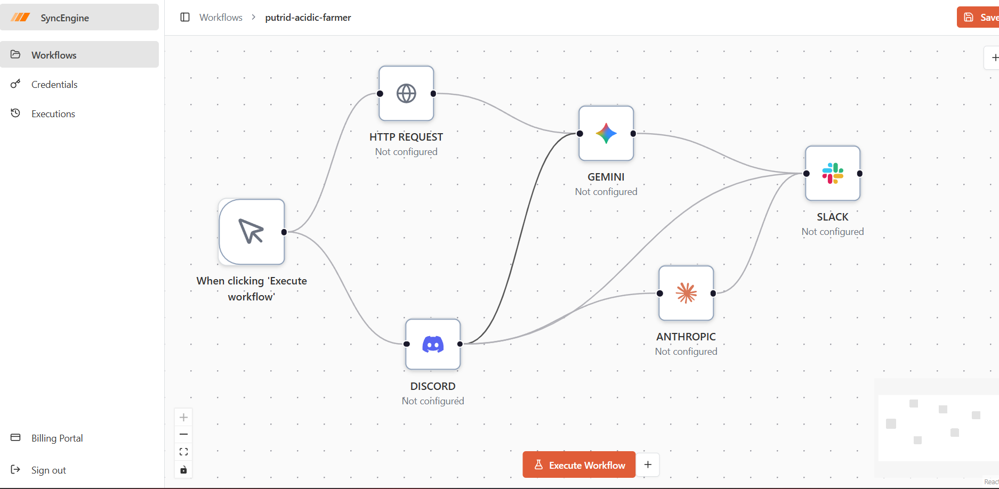

## 🔌 Supported Integrations
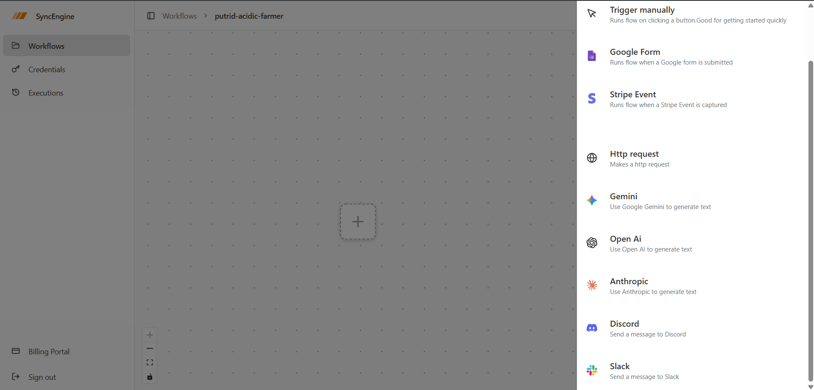
## 🔐 Authentication
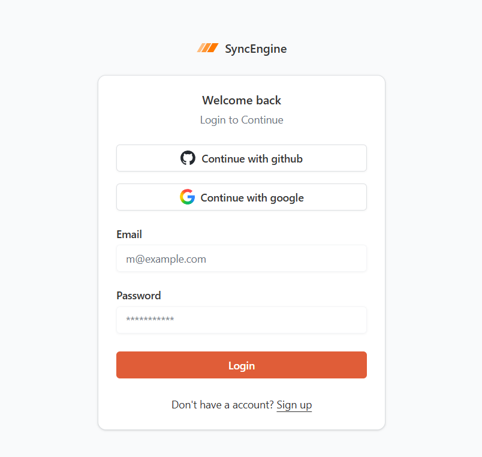

## 🧩 Multiple Workflow Views
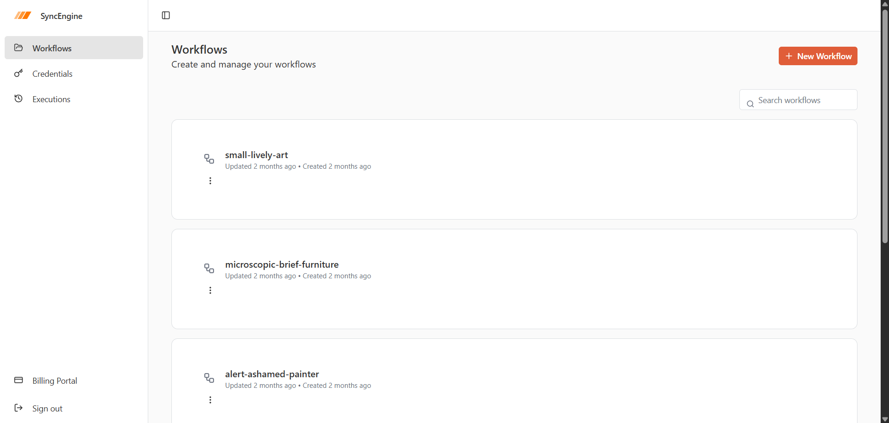

## 📸 Workflow Builder

## 🤖 AI Node Configuration
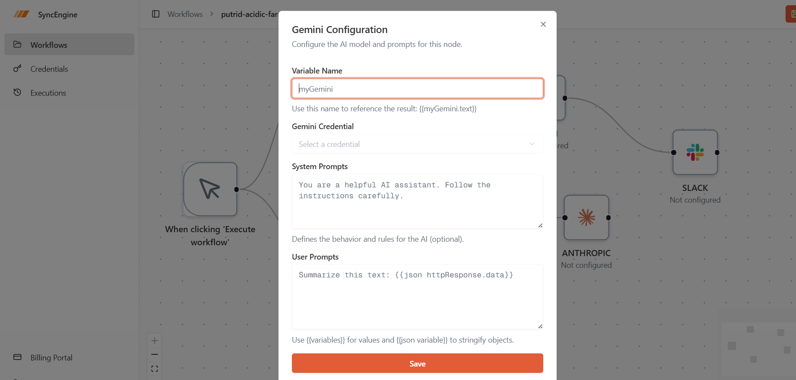

## 🌐 HTTP Request Node
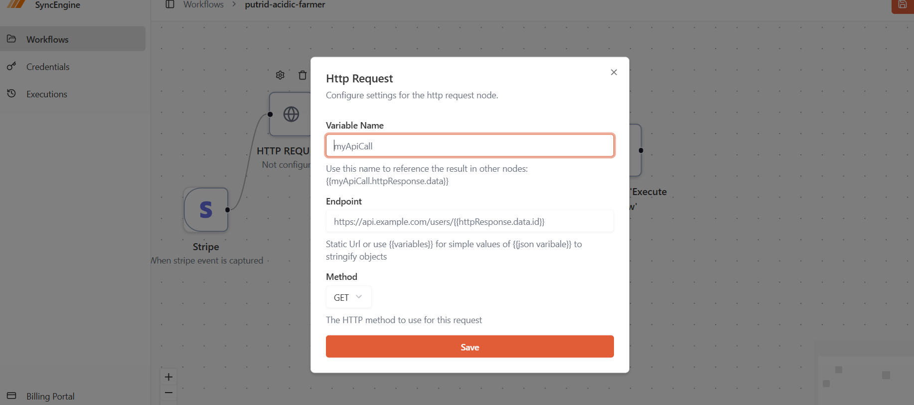

## 🖱️ Manual Trigger Node
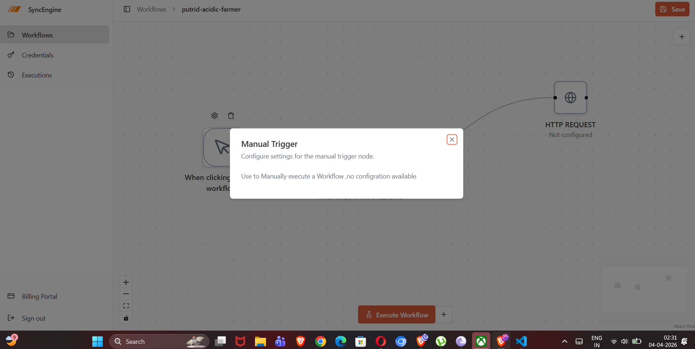

## 💬 Slack Node Configuration
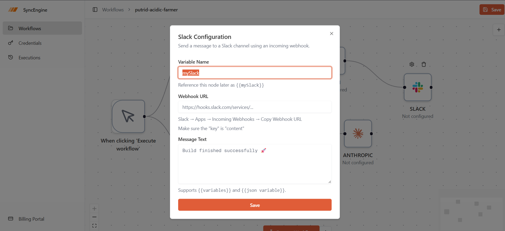

## 💳 Billing Portal
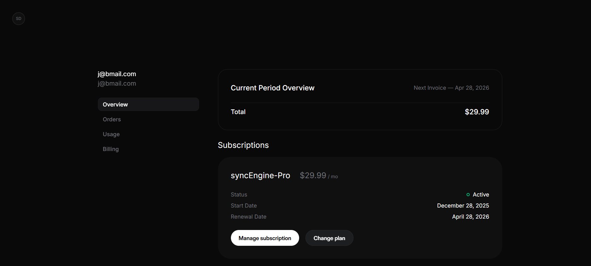

## 🧾 Subscription & Invoice Management
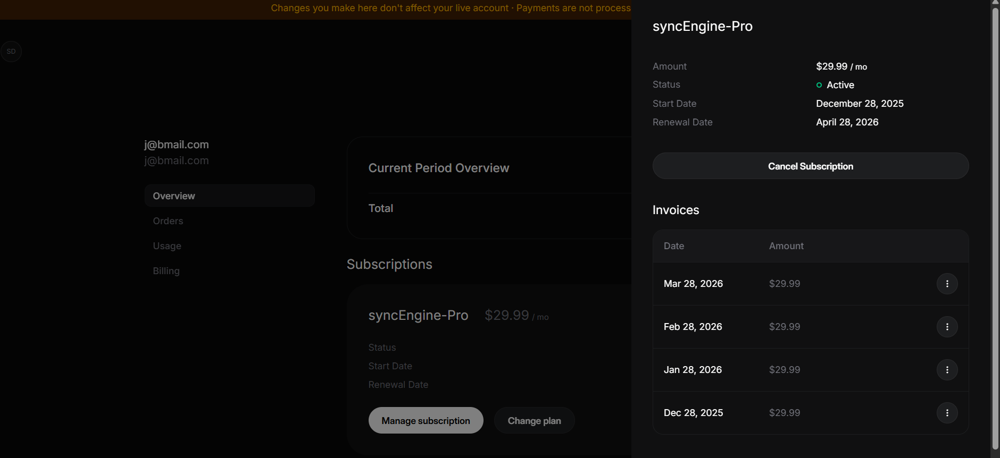


## 🚀 Live Workflow Execution
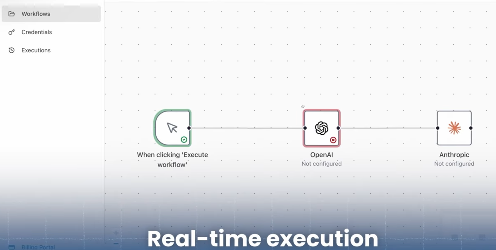
## ✨ Features

* **Visual Workflow Builder** – Create multi-step workflows with triggers, actions, and conditional branches.
* **Execution Engine** – Reliable workflow execution pipeline with retries and step-level logging.
* **Background Jobs** – Async task processing for long-running workflow executions.
* **AI-Powered Nodes** – Integrate LLM-based automation steps for smart decision making.
* **Webhook Triggers** – Start workflows from external events in real time.
* **Scheduling / Cron Jobs** – Run workflows on intervals or fixed times.
* **Authentication & Multi-user Support** – Secure access with user/project isolation.
* **Execution History** – Inspect every run with logs, status, and payload snapshots.
* **Scalable Architecture** – Designed for distributed workers and horizontal scaling.
* **Extensible Node System** – Easily add custom integrations and actions.

---

## 🏗️ Architecture Overview

SyncEngine is split into multiple core services:

### 1) API Layer

Handles:

* authentication
* workflow CRUD
* execution requests
* webhook endpoints
* user/project management

### 2) Workflow Execution Engine

Responsible for:

* DAG traversal / sequential step execution
* conditional routing
* retries & failure handling
* step outputs and context passing

### 3) Queue + Workers

Processes background jobs for:

* delayed workflows
* retries
* async integrations
* scheduled tasks

### 4) Database Layer

Stores:

* workflows
* nodes & edges
* execution history
* credentials
* logs
* schedules

---

## 🛠️ Tech Stack

> Update this section with your exact stack.

* **Frontend:** Next.js, React, TypeScript, TailwindCSS
* **Backend:** Node.js / Next.js API / Express
* **Database:** PostgreSQL
* **ORM:** Prisma
* **Queue:** BullMQ / Redis
* **Realtime:** Socket.IO
* **Auth:** Better Auth / JWT
* **Deployment:** Vercel + Railway / Docker

---

## 📂 Project Structure

```bash
syncengine/
├── apps/
│   ├── web/                 # Frontend app
│   └── api/                 # Backend APIs
├── packages/
│   ├── workflow-engine/     # Core execution logic
│   ├── queue/               # Background workers
│   ├── integrations/        # External app connectors
│   └── ui/                  # Shared components
├── prisma/
│   └── schema.prisma
├── docker/
├── docs/
└── README.md
```

---

## ⚙️ Local Setup

### 1) Clone the repository

```bash
git clone https://github.com/your-username/syncengine.git
cd syncengine
```

### 2) Install dependencies

```bash
pnpm install
```

### 3) Configure environment variables

Create `.env`:

```env
DATABASE_URL=
REDIS_URL=
AUTH_SECRET=
NEXT_PUBLIC_APP_URL=
OPENAI_API_KEY=
```

### 4) Run database migrations

```bash
pnpm prisma migrate dev
```

### 5) Start development server

```bash
pnpm dev
```

---

## 🔄 How Workflow Execution Works

1. User creates a workflow using the visual builder.
2. Workflow definition is stored as nodes + edges.
3. A trigger event fires (webhook, schedule, manual).
4. Execution engine resolves dependency order.
5. Each node executes with shared context.
6. Outputs are passed to downstream nodes.
7. Failures trigger retry policies.
8. Final execution logs are persisted.

---

## 📸 Core Modules

### Trigger Nodes

* Webhook
* Cron
* Manual
* Event listeners

### Action Nodes

* HTTP requests
* Database queries
* Email sending
* Slack / Discord notifications
* File storage

### AI Nodes

* text generation
* summarization
* routing
* classification
* extraction

---

## 🚀 Future Improvements

* distributed execution clusters
* workflow versioning
* marketplace for custom nodes
* team collaboration
* usage analytics
* rate limiting per workflow
* dead-letter queues
* execution replay

---

## 🤝 Contributing

Contributions are welcome.

1. Fork the repo
2. Create a feature branch
3. Commit your changes
4. Push the branch
5. Open a PR

---

## 📜 License

MIT License

---

## 👨‍💻 Author

Built by **Aditya Chaturvedi** as a production-grade workflow automation SaaS.
